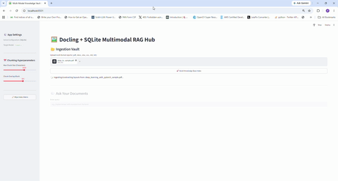

# 🤖 LangGraph Multimodal AI Agent Hub

A localized, high-fidelity Multimodal RAG & Agent Platform optimized for technical documents, textbooks, and structured datasets. Built using **LangGraph state machines**, it parses complex files into layout-aware Markdown representations, extracts dynamic tabular context, and streams reasoning steps directly inside an interactive UI.

---

## 🏗️ Architecture Blueprint

* **Orchestrator:** Multi-step **LangGraph State Machine** managing retrieval and reasoning nodes.
* **Document Parsing Engine:** Layout-aware multimodal document parser extracting structured text, dynamic tables, and visual diagram assets.
* **Context & Asset Inspector:** Dual-pane Streamlit dashboard that displays extracted visual elements, CSV tables, and raw chunk contexts side-by-side with chat interactions.
* **Localized LLM Engine:** Powered by local Ollama instances (compatible with `llama3.2`, `deepseek-r1`, etc.) with built-in monologue stripping (`<think>` tags) and privacy-first local boundaries.

---

## 🎛️ UI & Features

* **💬 Active Conversation Space:** Streamed agent execution updates (`st.status`) inline within the chat stream.
* **🔍 Asset & Schema Inspector:** Instant rendering of extracted tabular CSV dataframes and diagram images retrieved during tool execution.
* **📂 Ingestion Vault:** Multi-format uploader supporting `PDF`, `DOCX`, `XLSX`, `CSV`, `MD`, and `TXT` files with dynamic chunking.
* **⚙️ Agent Settings:** Real-time adjustments for:
  * Chunk Size & Overlap Parameters
  * Retrieval Top-$K$ Windows
  * Generation Temperature & Top-$K$ parameters
  * One-click Index/Database Flushing

---

## 🐳 Option 1: Running Fully Containerized (Using Docker)

Use this method to run your database pipeline, application UI, and AI models fully self-contained inside isolated Docker environments.

### Step 1: Ensure Prerequisites are Met
1. Install [Docker Desktop for Windows](https://docs.docker.com/desktop/install/windows-install/).
2. Install the [NVIDIA Container Toolkit](https://docs.nvidia.com/datacenter/cloud-native/container-toolkit/latest/install-guide.html) if utilizing an active discrete GPU layout.

### Step 2: Configure Application Files
Ensure your project contains a standard default `Dockerfile` and your revised `docker-compose.yml`.

### Step 3: Spin Up Infrastructure
Open your terminal inside the `D:\simple_agent` root workspace directory and execute:
```powershell
# Bring down existing containers and clean stale references
docker compose down

# Force rebuild application layers and boot detached containers
docker compose up --build -d
```
### Step 4: Validate Download Matrix
The background engine will execute entrypoint.sh automatically to fetch your parameters. Watch the live download layer stream using:
```powershell
docker logs -f ollama_service
```
Once the terminal outputs Model initialization complete!, navigate your web browser to http://localhost:8501 to access your dashboard interface.

## 💻 Option 2: Running Locally
Use this option to run the Python application scripts and Ollama directly on your host machine bare-metal, bypassing Docker entirely.

### Step 1: Install and Run Ollama Locally on Windows
1. Download the official native installer: Ollama for Windows Installer.

2. Run the executable file (OllamaSetup.exe) and proceed through the basic wizard layout steps.

3. Once fully installed, verify that the application background engine daemon is running (look for the Ollama icon in your Windows taskbar tray).

4. Open a fresh PowerShell window on your host computer and pull the llama3.2 model parameters into your local storage matrix:

```powershell 
ollama pull llama3.2
```
5. Test that the local engine responds instantly by issuing a quick verification query:
```powershell
ollama run llama3.2 "Say hello!"
```

### Step 2: Set Up Local Python Virtual Environment
Open a dedicated terminal (cmd or PowerShell or teminal based on os) and went to this project directory
``` powershell
# 1. Initialize a localized clean Python environment isolation block
python -m venv .venv

# 2. Activate the workspace scope window state
# On PowerShell:
.\.venv\Scripts\Activate.ps1
# On classic Command Prompt (CMD):
.\.venv\Scripts\activate.bat

# 3. Upgrade basic pip installer layers
python -m pip install --upgrade pip

# 4. Install standard layout framework packages and dependencies
pip install -r requirements.txt
```
### Step 3: Configure Environment Routing Variables
Tell your local code application to look at your native Windows machine engine loop instead of network container clusters. Create or update your local .env configuration file inside
```
OLLAMA_BASE_URL=http://localhost:11434
```
### Step 4: Boot the Streamlit UI Dashboard Interface
With your virtual environment activated, boot up your presentation interface from the command line:
```powershell
streamlit run app_ui.py
```
Your system will automatically launch a secure local host browser tab running at http://localhost:8501. You can now modify document parsing variables, clear underlying cache partitions, and verify text lookups natively without container virtualization delays.

