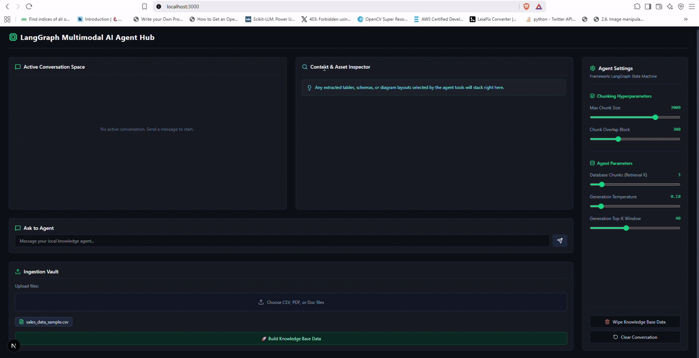
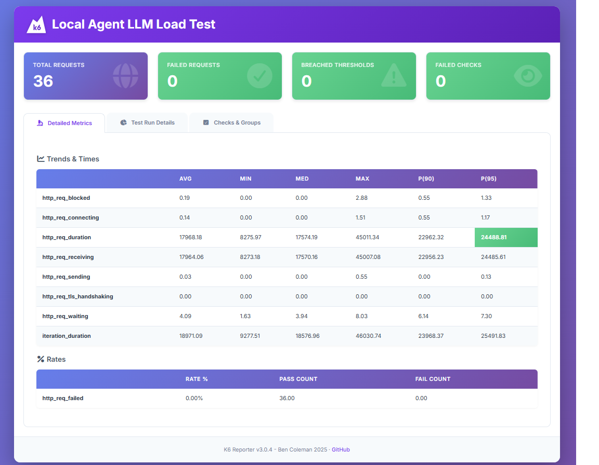

# 🤖 LangGraph Multimodal AI Agent Hub (FastAPI + Next.js)

A localized, high-fidelity Multimodal RAG & Agent Platform optimized for technical documents, textbooks, and structured datasets. Built using a decoupled microservice architecture with a **FastAPI (Uvicorn)** backend and an interactive **Next.js** frontend surface, it parses complex files into layout-aware Markdown representations, extracts dynamic tabular context, and streams real-time reasoning steps directly via Server-Sent Events (SSE).

**__Note__**: rushabh2390 and RddArihant are both my personal accounts

---

## 🏗️ Architecture Blueprint

* **API & Business Engine:** **FastAPI** running on high-throughput **Uvicorn** workers, handling async REST endpoints, file ingestion, Pydantic v2 validations, and token streaming over SSE.
* **Frontend Surface:** **Next.js (App Router)** built with React, Tailwind CSS, and Lucide icons, featuring real-time event-streaming chat interfaces and interactive asset rendering.
* **Orchestrator:** Multi-step **LangGraph State Machine** managing retrieval, tool routing, and reasoning loops.
* **Document Parsing Engine:** Layout-aware multimodal document parser extracting structured text, dynamic tables, and visual diagram assets.
* **Vectorless Context Indexer:** Native SQLite FTS5 indexer using BM25 ranking for millisecond-fast context lookups without embedding compute overhead.
* **Localized LLM Engine:** Powered by self-hosted Ollama containers (`llama3.2`, `qwen2.5-coder:3b`) with built-in monologue stripping (`<think>` tags) and strict zero-data-leakage privacy boundaries.

---

## 🎛️ Features & User Experience

* **💬 Live Token & Reasoning Stream:** Real-time agent status updates and text generation streamed via Server-Sent Events (SSE).
* **🔍 Dual-Pane Asset Inspector:** Instant side-by-side rendering of extracted tabular CSV dataframes, visual diagrams, and raw document context chunks[cite: 2].
* **📂 Multi-Format Ingestion Vault:** Upload support for `PDF`, `DOCX`, `XLSX`, `CSV`, `MD`, and `TXT` with dynamic chunking[cite: 2].
* **⚙️ Dynamic Agent Tuning:** Live control over chunk size, overlap, retrieval Top-$K$ windows, temperature, and database flushing[cite: 2].

---

## 🐳 Option 1: Running Fully Containerized (Docker Compose)

Use this method to run your database pipeline, FastAPI backend, Next.js UI, and Ollama engine inside isolated Docker environments[cite: 2].

### Step 1: Ensure Prerequisites are Met
1. Install [Docker Desktop for Windows/Linux](https://docs.docker.com/desktop/)[cite: 2].
2. Install the [NVIDIA Container Toolkit](https://docs.nvidia.com/datacenter/cloud-native/container-toolkit/latest/install-guide.html) if utilizing GPU acceleration[cite: 2].

### Step 2: Spin Up Infrastructure
Open your terminal in the project root directory and run[cite: 2]:

```powershell
# Bring down existing containers and clean stale references
docker compose down

# Force rebuild application layers and boot containers in detached mode
docker compose up --build -d
```
### Step 3: Validate Engine Initialisation
Watch the live model pulling and entrypoint execution via logs.
```powershell
docker logs -f ollama_service
```
Once initialization is complete, access your services at:

Next.js Web Dashboard: http://localhost:3000

FastAPI Swagger Docs: http://localhost:8000/docs

## 💻 Option 2: Running Locally (Bare Metal)
Use this option to run the FastAPI backend, Next.js frontend, and Ollama engine natively on your host machine.

### Step 1: Install & Boot Local Ollama Engine
1. Install Ollama for Windows/Linux.

2. Open a terminal window and pull the required model
```powershell
ollama pull llama3.2
```
### Step 2: Set Up & Launch FastAPI Backend (Uvicorn)
---

## 🔑 Environment Configuration (`.env`)

Create a `.env` file in the root directory of the project to configure your environment variables, including optional **LangSmith** observability tracing:

```env
# Server Settings
BACKEND_PUBLIC_API_URL=http://localhost:8000
INTERNAL_BACKEND_API_URL=http://backend_api:8000

# LangSmith Tracing & Observability (Optional)
LANGCHAIN_TRACING_V2=true
LANGCHAIN_ENDPOINT=[https://api.smith.langchain.com](https://api.smith.langchain.com)
LANGCHAIN_API_KEY=ls__your_langsmith_api_key_here
LANGCHAIN_PROJECT=simple-document-ai-agent
```
Open a terminal inside the /backend directory
```PowerShell
# 1. Initialize Python virtual environment
python -m venv .venv

# 2. Activate environment
# PowerShell:
.\.venv\Scripts\Activate.ps1
# CMD / Bash:
source .venv/bin/activate

# 3. Upgrade pip & install dependencies
pip install --upgrade pip
pip install -r requirements.txt

# 4. Start Uvicorn development server
uvicorn main:app --host 0.0.0.0 --port 8000 --reload
```
The FastAPI backend server will be running live at http://localhost:8000.

### Step 3: Set Up & Launch Next.js Frontend
Open a separate terminal inside the /frontend directory:
```PowerShell
# 1. Install Node modules
npm install

# 2. Set environment variables (.env.local)
NEXT_PUBLIC_API_BASE_URL=http://localhost:8000

# 3. Start Next.js development server
npm run dev
```
Navigate your browser to http://localhost:3000 to access the interactive dashboard.


## ⚡ Load Testing & Performance Benchmarks

The full end-to-end local document AI execution pipeline (FastAPI + SQLite FTS5 + Ollama LLM) was stress-tested using **K6**.

[](k6-report-summary.png)
> 🔗 **[Click here to view the Interactive Live HTML Dashboard](summary.html)**

### Performance Summary

| Metric | Result | Target / Standard |
| :--- | :--- | :--- |
| **HTTP Request Success Rate** | **100%** (0 errors) | Zero failed API calls |
| **Total Workflows Completed** | **36 iterations** | Multi-stage load test run |
| **Mean End-to-End Latency** | **17.96 seconds** | FTS5 search + Ollama inference pipeline |
| **P90 Response Time** | **22.96 seconds** | 90% of requests resolved under 23s |
| **P95 Response Time** | **24.48 seconds** | 95% of requests completed cleanly within 25s |
| **Hardware Constraints** | **4 VUs (Max)** | Optimized for 16GB RAM / 4GB VRAM limits |